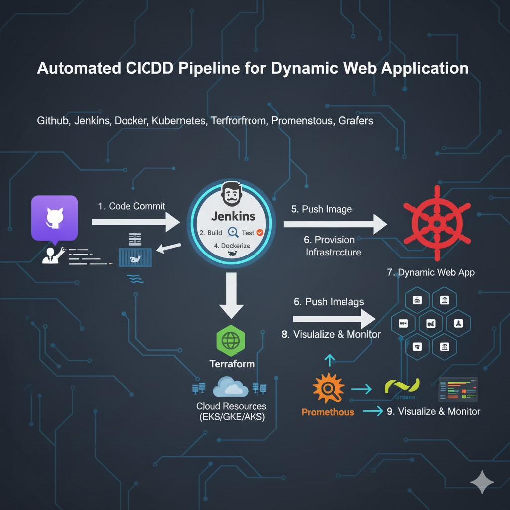

<<<<<<< HEAD
# Automated-CI-CD-Pipeline-for-Dynamic-Web-Application
=======
Automated CI/CD Pipeline for Dynamic Web Application

1. Project Description

An automated DevOps pipeline that builds, tests, and deploys a dynamic web application using GitHub, Jenkins, Docker, and Kubernetes. It integrates Terraform for infrastructure provisioning and Prometheus/Grafana for monitoring, ensuring scalable, reliable, and consistent deployments while reducing release time and minimizing manual errors.

2. Architecture & Workflow

This project implements a full CI/CD pipeline, automating the process from code commit to production monitoring.

Code (CI): A developer pushes code to a main or feature branch in the GitHub repository.

Trigger (CI): A GitHub webhook notifies the Jenkins server of the new commit.

Build & Test (CI): Jenkins checks out the code, builds the application (e.g., npm install & npm run build), and runs automated unit/integration tests.

Package (CI): Upon successful tests, Jenkins builds a Docker image of the application using a Dockerfile. This image is then pushed to a container registry (like Docker Hub or AWS ECR).

Provision (CD): Terraform is used for Infrastructure as Code (IaC). It reads configuration files to provision and manage the necessary infrastructure, such as the Kubernetes (EKS, GKE, or AKS) cluster itself.

Deploy (CD): Jenkins triggers the deployment stage, using kubectl or a Helm chart to apply the new application manifest to the Kubernetes cluster, pulling the updated Docker image from the registry.

Monitor: Prometheus is configured to scrape metrics from the Kubernetes cluster and the running application. Grafana connects to Prometheus as a data source to visualize these metrics in real-time dashboards (e.g., CPU/memory usage, error rates, request latency).

3. Technologies Used

Version Control: GitHub

CI/CD Automation: Jenkins

Containerization: Docker

Orchestration: Kubernetes (K8s)

Infrastructure as Code (IaC): Terraform

Monitoring & Alerting: Prometheus

Visualization: Grafana

4. Key Goals & Features

Full Automation: Minimize manual intervention from code commit to deployment.

Scalability: Use Kubernetes to easily scale the application up or down based on demand.

Reliability: Ensure consistent environments from development to production using Docker and Terraform.

Observability: Gain deep insights into application and cluster performance with Prometheus and Grafana.

Reduced Release Time: Accelerate the delivery of new features and bug fixes.

5. Future Work

Integrate security scanning tools (e.g., SonarQube, Trivy) into the pipeline.

Implement GitOps principles using a tool like Argo CD.

Set up automated alerting rules in Prometheus/Alertmanager.

Expand Terraform modules to manage more cloud resources (e.g., databases, load balancers).
>>>>>>> a1fda23 (Added Readme.md file)
